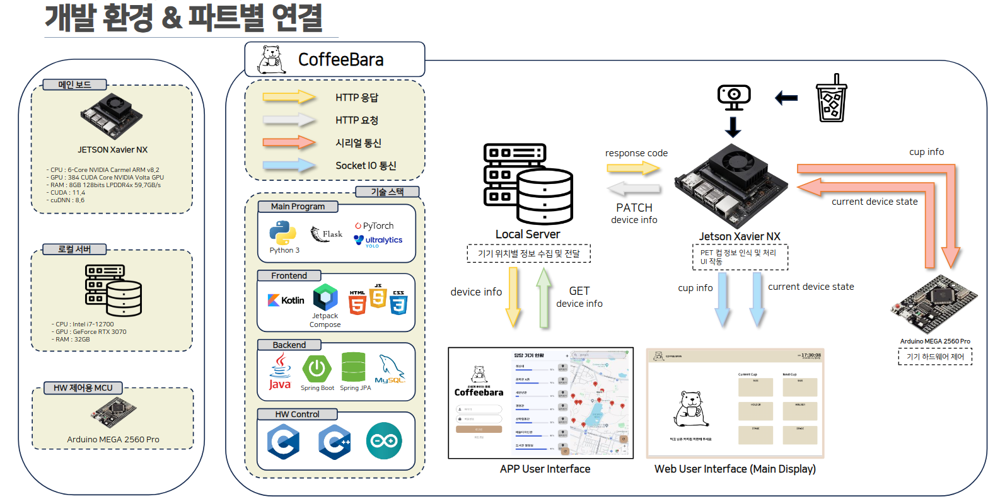
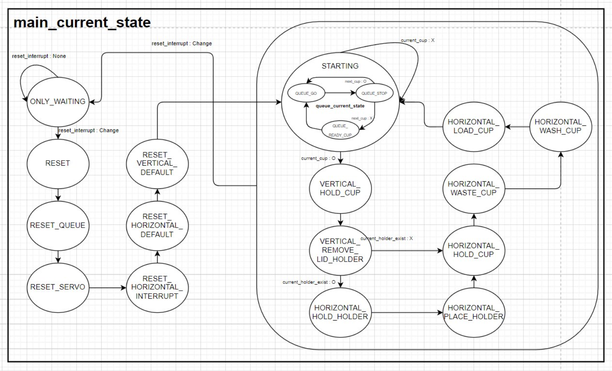

# 2024ESWContest_free_1125

## 🔖 Intro
Coffeebara는 PET 컵 완전 자동 분리 디바이스로, 효율적인 테이크아웃 컵 수거를 목표로 합니다. 

## 💡 Inspiration
테이크아웃 카페가 증가함에 따라 소비자의 PET 컵 사용이 급증했습니다. 그에 따라 다양한 문제가 대두되었는데, 그중 사용을 완료한 PET 컵을 버리는 과정에서 내용물 유무와 상관없이 쓰레기 수거함 주변에 그냥 올려두고 가는 경우가 문제가 되고 있습니다. 이는 시각적으로도 좋지 않으며, 재활용 분류가 잘 행해지지 않는다는 것을 나타냅니다. 

저희는 이에 대한 원인이 재활용 분류의 번거로움에 있다고 판단하였습니다. 소비자는 기존과 동일하게 올려놓기만 하면 되지만 재활용 분류를 자동으로 해주는 장치가 있다면 좋겠다고 판단했습니다. 나아가 세척 작업까지 제공해주면 PET 컵의 재활용률이 올라갈 것으로 기대합니다. 

## 📸 Overview


<br>

1. PET 컵이 입구에 진입
2. 컵이 큐 체인을 통해 이동
3. 카메라를 통해 컵 정보를 추출 (컵 사이즈, 입구 사이즈, 빨대 유무, 홀더 유무)
4. Jetson Xavier에서 컵 정보를 토대로 아두이노로 serial 통신
5. 컵 뚜껑, 홀더 제거 및 분류
6. 펌프를 통해 컵 내부를 세척
7. 컵 사이즈에 따라 적재함에 분류
8. 컵이 일정 개수 이상 쌓이면 아래 수거함으로 분류

## 👀 Main feature
- ### 1️⃣ AI 모델로 컵 정보 추출

    온디바이스에서의 빠른 작동을 위해 input 이미지를 320*320으로 학습을 진행했습니다. realtime 동작에는 계산량이 많아지기 때문에 외부 센서를 통해 들어온 물체가 있을 경우에만 이미지 분석을 했고, 인식해야하는 물체가 플라스틱 컵뿐이므로 이외의 값은 null로 annotate처리를 통해 정확하게 플라스틱 컵만 인식하도록 했습니다. 플라스틱 컵이 규격이 일정하지 않고, 사용자가 컵을 일정한 형식으로 넣지 않을 것이기 때문에 컵을 정확하게 분석하여 분리하기 위해서 컵 전체 크기, 컵 입구의 크기, 홀더 유무, 빨대 유무를 학습했습니다. 이러한 값을 얻기 위해서는 semantic segmentation이나 instance segmentation까지는 필요하지 않고 object detection으로 값을 다 받아올 수 있기 때문에 yolov8의 object detection을 활용하였습니다.
    

 - ### 2️⃣ 디바이스 동작

    #### 1 .컵 인식 & 큐 작동​
    

    <br>
    <details>
        <summary> state 상세설명 ⏬ </summary>

    - #### <QUEUE_GO>
        
        큐가 움직이는 경우에 대한 state입니다. ​CurrentCUP 객체의 cup_size, entrance_size, holder_exist를 NextCUP 객체로부터 불러옵니다.​ 컵으로 인식된 CurrentCUP 객체가 존재하는 경우 하드웨어 동작을 위해 servo_attach 함수를 실행하여 서보 모터를 활용할 수 있도록 합니다.​ 커피 투입구에 원하는 크기의 컵을 놓기 위해 VERTICAL_STEPPER_finger(수직 이동 그리퍼)를 미리 정의한 수준으로 움직입니다.​ CurrentCUP이 정의되고 내부 하드웨어 동작 준비가 끝난 후 큐를 시계 방향으로 움직여 커피 투입구에 PET 컵이 놓이도록 합니다.​
    - #### <QUEUE_STOP>

        QUEUE_GO state에서 움직인 후, 큐가 정지된 경우에 대한 state입니다.queue_positioning 함수를 통해 큐 위치를 보정하도록 합니다. ​해당 state에서는 메인 보드와 아두이노의 시리얼 통신을 진행합니다. 메인 보드에 연결된 웹캠을 통해 인식한 컵의 정보를 전달하며, 해당 정보는 tx_rx_data라는 변수를 통해 전달됩니다.​ PET 컵 인식을 위해 아두이노에서 메인보드로 신호를 전달하며 메인 보드에서는 해당 신호를 통해 컵 인식 시점을 결정합니다.​ 이후 아두이노에서는 시리얼 통신을 통해 전달 받은 컵 정보를 NextCUP 객체에 저장할 수 있도록 합니다. ​시리얼 통신을 통해 주고 받는 데이터는 1Byte로, 다음과 같은 8비트 구성을 갖습니다. ​처리중인 CurrentCUP이 존재하지 않는 경우, main_current_state를 response로 갖는 메인 보드의 프로그램 역시 응답을 기다려선 안되기 때문에 tx_rx_data를 0x1000_000로 설정하여 전송하도록 합니다. 
    - #### <QUEUE_READY_CUP>

        현재 처리중이거나 인식중인 PET 컵이 존재하지 않는 경우에 대한 state입니다.​사용자가 PET 컵을 큐의 입구에 놓을 때까지 대기하며, 초음파 센서를 통해 추가된 컵을 인식하여 queue_current_state를 변경하도록 합니다. 이때, 초음파 센서의 임계치는 7cm로 설정합니다.

    </details>

    #### 2. 분리
    

    <br>

    <details>
        <summary> state 상세설명 ⏬ </summary>

    - #### <VERTICAL_HOLD_CUP>​

        뚜껑 제거를 위해 PET 컵 투입구에 놓인 컵을 강하게 잡도록 하는 state입니다. 컵에 의한 수직 이동 스텝 모터의 움직임을 최소화하기 위해 vertical_step_hold 함수를 통해 스텝 모터에 토크가 걸리도록 합니다.​remove_lid_servo_in 함수를 통해 뚜껑 제거를 위한 장치를 PET 컵 입구 크기에 맞춰 제어하도록 합니다.

    - #### <VERTICAL_REMOVE_LID_HOLDER>​

        뚜껑을 제거하고 홀더 제거를 준비하도록 하는 state입니다.​VERTICAL_STEPPER_move 함수를 통해 수직 이동 스텝모터가 vertical_pos_remove_lid 만큼 이동하도록 합니다.​ CurrentCUP에 홀더가 존재하는 경우, 존재하지 않는 경우를 나누어 main_current_state가 다르게 변화하도록 합니다.

    - #### <HORIZONTAL_HOLD_HOLDER>

        홀더 제거를 위한 state입니다. 수평 이동 그리퍼가 홀더 제거를 위해 작동하며 수평 이동 스텝 모터의 움직임을 최소화하기 위해 horizontal_step_hold 함수를 활용하여 스텝 모터에 토크가 걸리도록 합니다.​ 이후 수직 이동 그리퍼를 이동시켜 컵은 상단부로 이동하며 수평 이동 그리퍼에는 홀더만 남도록 합니다.

    - #### <HORIZONTAL_PLACE_HOLDER>

        HORIZONTAL_HOLD_HOLDER state에서 수평 이동 그리퍼가 잡고 있는 홀더를 놓기 위한 state입니다.

    - #### <HORIZONTAL_HOLD_CUP>

        PET 컵을 수평 이동 그리퍼로 전달하기 위한 state입니다.​ 수평 이동 그리퍼가 특정 수준으로 벌어졌을 때 수직 이동 그리퍼는 PET 컵을 완전히 놓아 수평 이동 그리퍼로 전달합니다. 전달받은 수평 이동 그리퍼는 추후 세척 및 적재 과정을 고려하여 조금 벌렸다 다시 잡는 과정을 진행합니다.​ 수직 이동 그리퍼는 더 이상의 작동이 없기 때문에 초기 위치로 돌아가도록 합니다.

    </details>

    #### 3. 세척
    

    <br>

    <details>
        <summary> state 상세설명 ⏬ </summary>

    - #### <HORIZONTAL_WASTE_CUP>

        PET 컵 내부 폐수를 처리하기 위한 state입니다.​ 수평 이동 그리퍼를 폐수 처리 구간으로 이동한 후, 수평 이동 그리퍼를 기울여 내부 폐수를 비우도록 합니다.

    - #### <HORIZONTAL_WASH_CUP>

        PET 컵 내부를 세척하기 위한 state입니다.​ 수평 이동 그리퍼를 설치된 워터 펌프에 맞는 각도로 설정한 후 세척 부분으로 이동합니다. 워터 펌프를 약 2초 동안 작동 시켜 내부를 세척하도록 합니다.​ 세척이 완료된 후 수평 이동 그리퍼를 폐수 처리 구간으로 다시 이동시켜 wash_post_process 함수를 활용해 내부 물기를 털어내도록 합니다.

    </details>

    #### 4. 적재

    

    <br>

    <details>
        <summary> state 상세설명 ⏬ </summary>

    - #### <HORIZONTAL_LOAD_CUP>

        처리된 폐수의 양을 측정하고 PET 컵 사이즈 별로 적재하도록 하는 state입니다.​PET 컵 사이즈 별 적재 위치는 미리 정의된 horizontal_pos_cup_size[]를 통해 결정하며 수평 이동 그리퍼를 벌려 적재하도록 합니다. 적재 후, 수평 이동 그리퍼는 초기 위치로 복귀합니다.​ 마지막으로 cleaning_cup 함수를 통해 적재 통을 비울지 말지를 결정하며 로드셀을 통해 측정한 폐수의 양을 메인 보드로 전달합니다.​ 이때, state machine은 STARTING으로 복귀합니다.
    </details>

    ### 전체 state machine
    
    
- ### 3️⃣ 서버 및 프론트

    #### 1. 서버
    

    <br>

    <details>
        <summary> class 상세설명 ⏬ </summary>

    - #### Controller

        Application Programming Interface를 열어두고 타 application과 json 정보를 주고 받기 위한 클래스입니다. ​Validation 클래스의 method를 호출해서 전달받은 DTO 형식이 올바른지 판단하고, 응답을 위한 Service의 method를 호출합니다. ​RestController 를 사용해서 DTO를 반환하면 HTTP body로 json 변환하여 제공합니다.

    - #### Service

        Controller 클래스에 의해 호출되며, 서버의 응답을 위해 DB에서 정보를 가져와 DTO에 mapping 하는 클래스입니다. ​DB에서 정보를 가져오기 위해 Repository 인터페이스의 메소드를 호출하고 data를 가공해서 DTO에 mapping하여 반환합니다. Data 가공, 패키징을 맡는 역할로, 주로 서버의 메인 로직을 담당합니다. 

    - #### Repository

        DB에 SQL query를 발생시켜서 원하는 Data를 가져오는 클래스입니다. Spring Data JPA 를 사용하여 interface만 정의하였고, 직접 JPQL을 명시하지 않고도 메서드만으로 query를 발생시킵니다. 가져온 data는 model entity로 mapping 해서 ORM 방식을 사용합니다. 복잡한 query는 JPQL로 직접 query를 작성해줄 수 있습니다. 

    - #### Model

        DB에서 가져온 data를 자바 객체로 사용하는 ORM 을 구현하기 위한 클래스입니다. DB에서 어떤 constraint를 사용할지를 클래스의 필드마다 명시해두었고, 연관관계도 XtoX 형식의 어노테이션을 사용해 명시해두었습니다. ​Application.yml 파일에 jpa..hibernate.ddl-auto:update로 설정해두어서 JPA가 entity를 알아서 parsing 하여 DB에 변경값을 적용하도록 설정했습니다. 

    - #### DTO

        Controller 클래스에서 http 패킷에서 json 정보를 받아오고, 보낼 때 json to class 방법을 사용하는데 이때 사용되는 클래스입니다. Spring validation의 어노테이션들을 사용해서 DTO의 제약사항을 걸어둘 수 있습니다. 이를 통해 data validation을 사용하여 데이터 무결성을 보장합니다. 

    - #### Validation

        DTO 에 명시된 validation 어노테이션으로 검증하지 못하는 검증 로직을 추가적으로 진행하기 위한  클래스로, controller 에 의해 호출됩니다. 만약 validation을 만족하지 못하면 exception을 발생시킵니다. 

    - #### Exception

        RuntimeException을 상속받은 클래스로 서버에서 발생시킬 exception 을 정의한 클래스입니다. 각 도메인 별로 발생할 수 있는 exception을 정의해두어서 각 상황을 만족하면 exception을 throw 시킵니다. 

    - #### Exception_Handler

        발생된 exception을 처리하는 클래스입니다. 언체크 Exception 같은 경우에는 처리해주지 않아도 컴파일되기 때문에 사용자가 exception 내용을 직접 마주하게 될 수 있습니다. 이러한 상황을 방지하기 위해서 발생시킨 exception마다 적절한 처리를 할 수 있도록 exception_handler에 로직을 명시해두었습니다. 이로써 사용자에게 exception 상황을 전달하지 않게 되어 사용자 친화적인 서버를 구현하였습니다. 
    </details>


    #### 2. AOS
    

    <br>

    <details>
        <summary> Page 상세설명 ⏬ </summary>

    - #### ​​​SplashScreen

        커피바라 앱의 스플래시 화면입니다. ​커피 컵 수거를 연상케 하는 아이콘과 팀 로고를 화면 가운데에 배치했습니다. 

    - #### RegisterScreen

        회원가입을 하는 화면입니다. 로그인 화면에서 회원가입 버튼을 누르면 이동하는 페이지로, 이름, 아이디, 비밀번호, 비밀번호 재확인 필드를 통해 사용자로부터 정보를 입력 받고 frontend 에서 validation을 진행합니다. 하단에 회원가입 버튼을 누르면 서버로 회원가입 요청이 전달됩니다.

    - #### LoginScreen

        로그인을 진행하는 화면입니다. 앱을 실행하면 스플래시 화면이 5초간 등장하고 가장 먼저 등장하는 페이지로, 사용자로부터 아이디, 비밀 번호를 입력받습니다. frontend에서 validation을 진행하고 서버로 인증 요청을 보냅니다. 서버로부터 인증을 받았다면 viewmodel에 사용자 정보를 저장해둡니다. 

    - #### ​​HomeScreen

        홈 화면에서 보여지는 화면입니다. ​로그인을 진행하고 바로 보여지는 화면으로, 서버로부터 디바이스의 정보를 바로 받아와서 해당 사용자 관할로 등록되어 있는 기기의 상태를 종축 List 형태로 나타냅니다. ​각 디바이스마다 액체 수거통의 용량을 status bar를 통해 나타냅니다. ​지도 보기 버튼을 누르면 해당 기기가 마커로 표시된 지도를 보여줍니다. ​서버로부터 받아온 디바이스 정보들을 viewmodel에 저장해두고 앱이 실행되고 있는동안 유지되며 재활용합니다.

    - #### MapScreen

        지도에 디바이스들을 마커로 표시해주는 화면입니다. 하단 navigation bar 또는, 지도보기 버튼을 통해 이동하는 페이지로, 각 디바이스 들의 위도, 경도 정보를 서버로부터 받아와서 마커로 표시합니다. 각 마커를 클릭하면 디바이스의 이름과 액체 수거통의 용량을 마커 위에 표시해줍니다.​ Google Map API를 사용해서 지도와 마커를 표시합니다. 

    - #### MyPageScreen

        사용자 마이페이지 화면입니다. 하단 navigation bar를 통해 이동하는 페이지로, 해당 유저의 정보를 확인하고 수정할 수 있는 기능을 제공합니다. 사용자 기기 등록/수정/삭제, 사용자 정보 수정 등의 기능을 제공합니다. 
    </details>


    #### DEVICE UI
    

    <br>

    Jetson Xavier와 Socket 통신을 통해 컵 정보와 현재 Device state 정보를 받아와서 디바이스 화면에 띄워주는 역할을 합니다. Javascript를 사용해서 Jetson Xavier와 socket port를 열어두고 값이 수신됨에 따라 UI 상태와 애니메이션을 변경하여, 사용자들로 하여금 현재 디바이스의 상태를 알 수 있도록 하고 있습니다. 


## Environment

### Embedded


### Backend


### Frontend


### Device UI


## File Architecture
```
2024ESWContest_자유공모_1125_커피바라_소스코드
    │ 
    ├── App 
    │    ├── Frontend
    │    |    ├── UI_pages
    │    |    ├── UI_modules
    |    |    ├── viewmodel
    |    |    ├── retrofit
    |    |    ├── navigation
    |    |    └── data
    |    └── Backend
    │          ├── user
    │          |    ├── controller
    |          |    ├── service
    |          |    ├── dto
    |          |    ├── model
    |          |    ├── exception
    |          |    ├── exception_handler
    |          |    ├── repository
    |          |    └── validation
    |          └── device
    │               ├── controller
    |               ├── service
    |               ├── dto
    |               ├── model
    |               ├── exception
    |               ├── exception_handler
    |               ├── repository
    |               └── validation             
    ├── arduino_src   
    |    ├── src
    |    |    └── HW_Control.ino
    |    └──include
    |         ├── Constants
    |         ├── CUP
    |         ├── Queue
    |         ├── StepperMulti
    |         └── Waterpump
    └── python_src    
        ├── UI
        |    ├── src
        |    |    ├── CoffeeBara.html
        |    |    ├── CoffeeBara.css
        |    |    └── CoffeeBara.js
        |    └── images
        └── main
            ├── model.pth
            └── main.py
```


## Video


## Team Member


<br>

| 팀원 | 역할 |
|----------|----------|
| 장시영(팀장)  | 하드웨어 제어용 SW 개발  |
| 권민혁   | 디바이스 UI 개발, APP 개발  |
| 김경우 | 전기장치 배선, 2D CAD 설계 및 제작 |
| 박영서 | 하드웨어 제작, 3D 프린팅 | 
| 박현준 | 컵 인식 AI, 3D 모델링 | 


